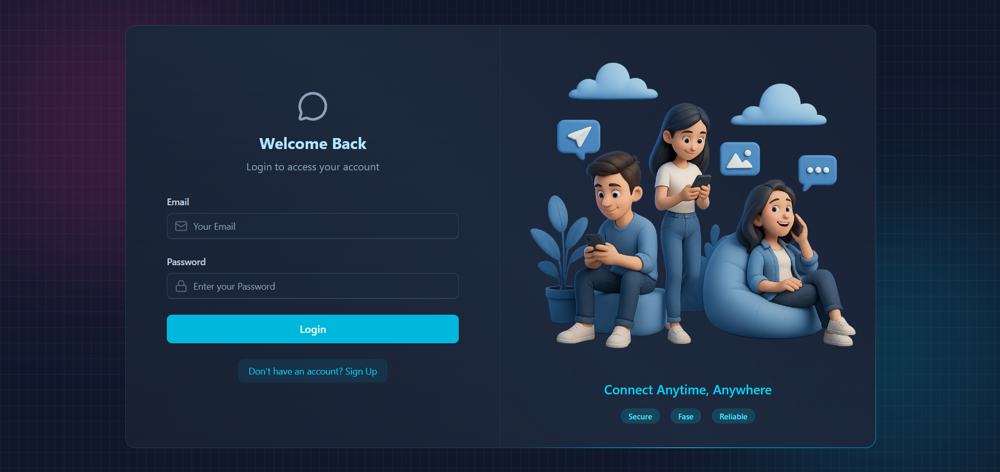

# 💬 Sd Realtime Chat App

A modern **real-time chat application** built with **React**, **Node.js**, **Socket.IO**, and **MongoDB**.  
It supports instant messaging, online user status, authentication, and a clean responsive UI.

---

## Live Link

[Sd Realtime Chat App](https://sd-realtime-chat-app.onrender.com)

## 📸 Screenshots



## 🚀 Features

- 🔐 User authentication (Signup / Login / Logout)
- 💬 Real-time messaging using Socket.IO
- 🟢 Online / Offline user status
- 🖼️ Image & text messages
- 🕒 Message timestamps (12-hour format)
- 📅 Smart date labels (Today / Day name / Full date)
- 👤 Profile update with image upload (Cloudinary)
- 🍪 JWT authentication with HTTP-only cookies
- 📱 Responsive and modern UI (Tailwind CSS + DaisyUI)

---

## 🛠️ Tech Stack

### Frontend

- React (Vite)
- Tailwind CSS + DaisyUI
- Zustand (State Management)
- Axios

### Backend

- Node.js
- Express.js
- Socket.IO
- MongoDB + Mongoose
- JWT Authentication
- Cloudinary (Image Uploads)

---

## ⚙️ Run Locally

1. Clone the repository:

   ```bash
   git clone https://github.com/danielace1/realtime-chat-app.git
    cd realtime-chat-app
   ```

2. Install dependencies for both frontend and backend:

   ```bash
   # Frontend
   cd client
   npm install

   # Backend
   cd ../server
   npm install
   ```

3. Create a `.env` file in the `server` directory and add the following environment variables:

   ```env
   PORT =
   MONGO_URI =
   NODE_ENV =
   JWT_SECRET =
   CLIENT_URL =
   RESEND_API_KEY =
   EMAIL_FROM =
   EMAIL_FROM_NAME =
   CLOUDINARY_CLOUD_NAME =
   CLOUDINARY_API_KEY =
   CLOUDINARY_API_SECRET =
   ARCJET_KEY =
   ARCJET_ENV =
   ```

4. Start the development servers:

   ```bash
    # Start Backend
    cd server
    npm run dev

    # Start Frontend
    cd ../client
    npm run dev
   ```

5. Open your browser and navigate to `http://localhost:5173` to access the application.

---

## 🤝 Contributing

Contributions are welcome! Please open an [issue](https://github.com/danielace1/realtime-chat-app/issues) or submit a [pull request](https://github.com/danielace1/realtime-chat-app/pulls) for any improvements or bug fixes.

## 📄 License

This project is licensed under the MIT License. See the [LICENSE](LICENSE) file for details.

---

## Author

- [Sudharsan A](https://sudharsan-a.vercel.app/)
